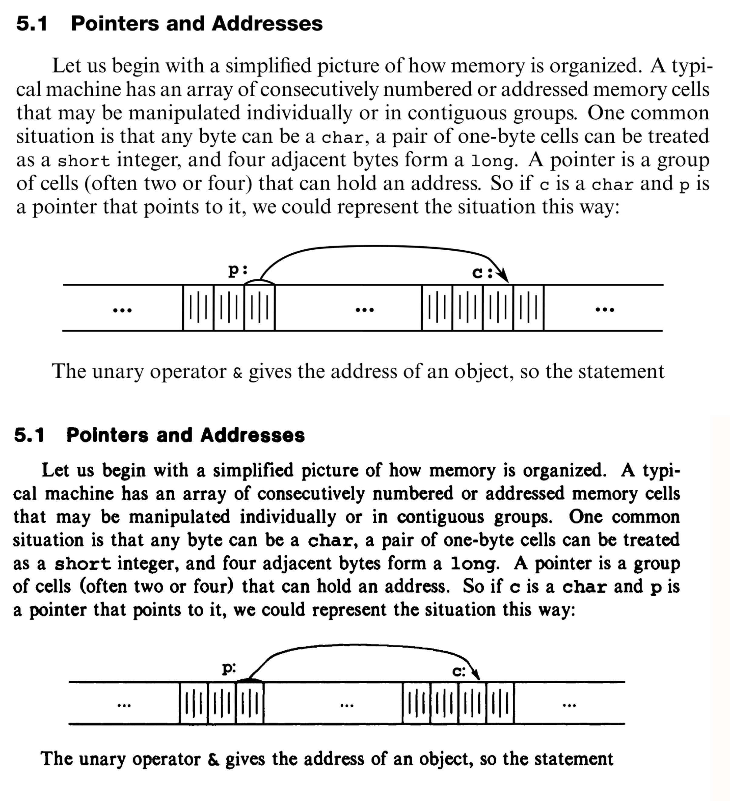
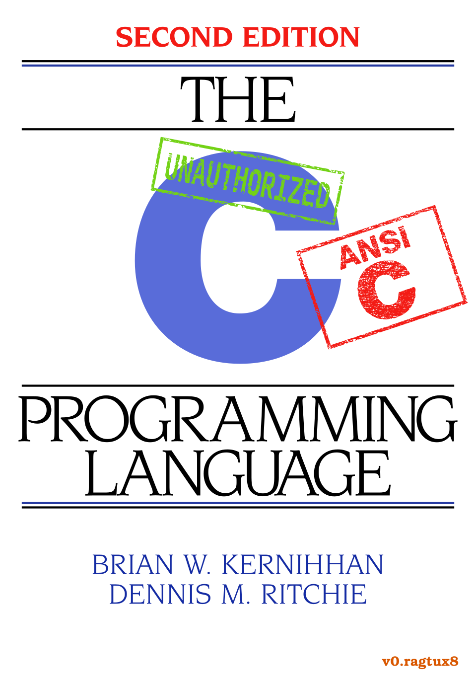

K&R 2E
=====

Welcome to the unauthorized K&R 2E repository! K&R is an amazing book both in
terms of its lasting historical impact (it's 50 years old!) and in the timeless
quality of its technical writing. It is truly a computer science classic.

The impetus for this project was my frustration with the seemingly non-existent
good quality (typeset, non-scanned) pdfs available. I had purchased both the
first and the second edition of K&R and was looking to buy a good quality
(typeset) pdf for digital reference but couldn't find one.

The typesetting is entirely LaTeX. The advantages of LaTeX is that - if
organized well enough - one can easily "rice" a doument. Most of the graphics
were done in Inkscape. There are plenty of drawing packages in LaTeX (e.g.
TikZ) but I am largely unfamiliar with them. I would love to learn more about
LaTeX and include them if anyone can provide good looking working examples.

I did this originaly using XeLaTeX which allows the use of system fonts. Since
some of the fonts used are non-free. I am currently working on coverting everything
to a free font so that everyone can work on it.

Project Goals
-------------
There are two objectives:

- [ ] A "vanilla" version that is as true to the original K&R 2E (stock size,
   fonts, layout, coloring, etc.) as ***reasonably*** possible.

- [ ] A "super deluxe" version inspired by what the guys
   [here](https://github.com/sarabander/sicp-pdf) did with SICP.  I really
   enjoy the font combo and the syntax highlighting. I would also like this
   deluxe version to have all its exercises hyperlinked to the answers which
   will be at the back of the book. The answers will come from the second
   edition of [Clovis L. Tondo's official answer book](https://www.amazon.com/Answer-Book-Solutions-Exercises-Programming/dp/0131096532).

TODO
-------------
- [ ] Complete Appendix A, B, and C
- [ ] Organize source files and push to repository.
- [ ] Thorough layout error checking. These are hopefully little things like somethings wasn't italicized when it should have been, or something was indented inconsistently.
- [ ] Transcription and testing of [Clovis L. Tondo's official answer book (2e)](https://www.amazon.com/Answer-Book-Solutions-Exercises-Programming/dp/0131096532) for use in the deluxe version.

Legal
-------------
I do not own this work, nor do I ask for money. Please support the publisher and authors by purchasing an [official copy](https://www.amazon.com/Programming-Language-2nd-Brian-Kernighan/dp/0131103628/ref=sr_1_1?dchild=1&keywords=Programming-Language-2nd-Brian-Kernighan&qid=1601353364&sr=8-1).

That being said this work is nearing 50 years old, and C has had its time in
the sun. A quick search on Google or GitHub will reveal many other bootleg
copies of the book. So this project shouldn't stand out in that sense.
